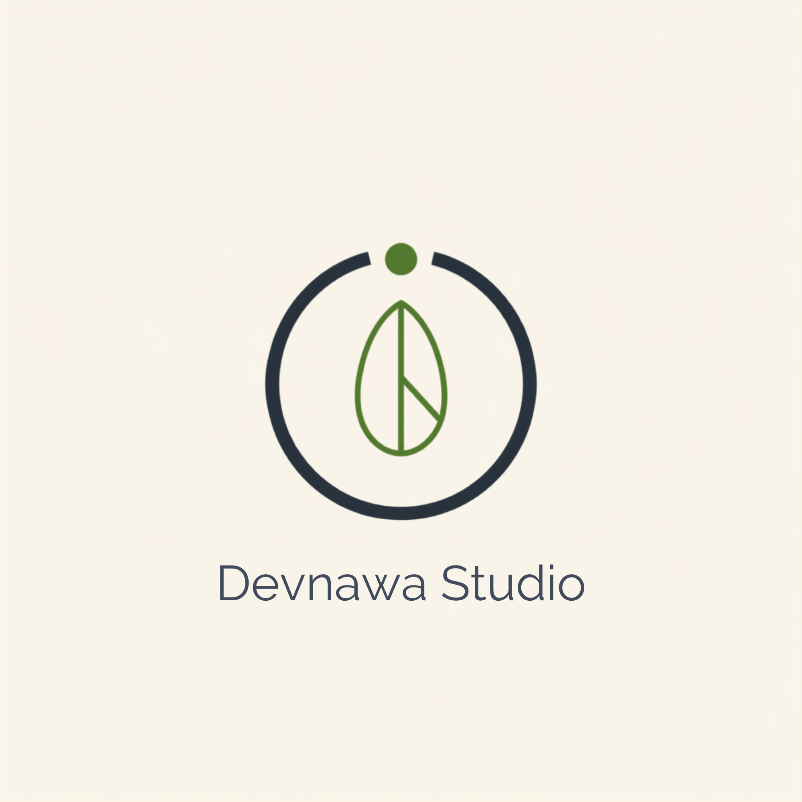

<h1>DEVNAWA STUDIO</h1>

 

 

---

## 🌿 À propos

**Devnawa Studio** est un collectif de développeurs freelance basés au Maroc, spécialisé en développement **Full Stack**. On transforme des idées en produits web solides — du design de l'API jusqu'à l'interface finale.

On travaille avec des clients marocains et francophones, sur des projets courts comme sur des collaborations longue durée.

 

## ⚙️ Stack technique

 

## 💡 Ce qu'on fait

<table align="center">
<tr>
<td align="center" width="220">
<b>🖥️ Applications Web</b> 
API REST Spring Boot + interfaces React sur mesure
</td>
<td align="center" width="220">
<b>🎨 Sites Vitrines</b> 
Design moderne, rapide, pensé conversion
</td>
<td align="center" width="220">
<b>🔧 Maintenance & Refonte</b> 
On reprend, on nettoie, on améliore l'existant
</td>
</tr>
</table>

 

## 📌 Projets épinglés

> 💡 Épinglez vos meilleurs repos depuis votre profil pour qu'ils s'affichent ici automatiquement (Customize your pins → GitHub profile).

<!-- Remplace REPO_1 et REPO_2 par vos vrais repos -->

 

## 📊 Activité

 

## 📬 Travaillons ensemble

Un projet en tête ? On serait ravis d'en discuter.

  

© 2026 Devnawa Studio — Fait avec 🌿 au Maroc

